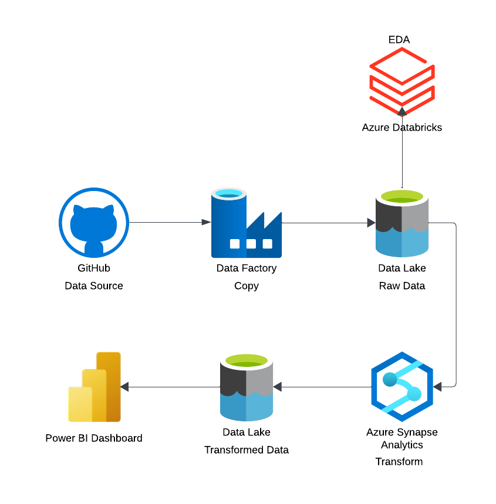

# Paris-Olympics-Data-engineering-
An end-to-end data engineering project on azure cloud services performing ETL and dash boarding on paris summer olympics data using azure data factory, databricks, synapse analytics and power bi

